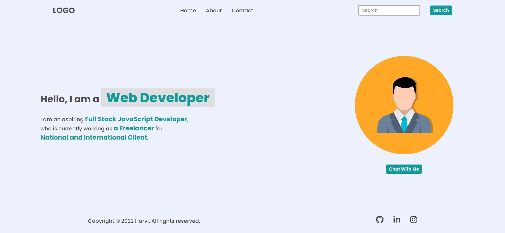

# DOM PROJECT 01

## Task 01
> To change "contact" to "Project" & add new list name as 'Hire Me' in the navbar & Remove Footer UL
 
**Before:**


**After Update:**


```js
//change "contact" to "Project"
const ul=document.querySelector("nav ul");

ul.lastElementChild.innerHTML="<a> Projects </a>"
 
//ADD A NEW LIST NAME AS "HIRE ME"
const newList=document.createElement("li");
newList.innerHTML="<a> Hire Me </a>"
ul.appendChild(newList);

//REMOVE FOOTER UL  
const footer=document.querySelector("footer")
const foo=document.querySelector("footer ul")
footer.removeChild(foo)
```

## Task 02

>TO CHANGE INPUT PLACEHOLDER FROM SEARCH TO SEARCH MY PROJECT

**Before:**


**After Update:**


```js
const inputText=document.querySelector(".search-field input");

inputText.placeholder="Search My Project";
```
## Task 03
>TO CHANGE TEXT 

**Before:**


**After Update:**


```js
const changeSpan=document.querySelectorAll(".hero-left-section p span");

//from "an Freelancer" to "an Employee"
changeSpan[1].innerText="an Employee";

//from "National and International Client" to "INeuron Intelligence Pvt Ltd"
changeSpan[2].innerText="INeuron Intelligence Pvt Ltd";
```
## Task 04
>TO CHANGE PROFILE IMAGE 

**Before:**


**After Update:**


```js
const profileChange=document.querySelector(".hero-right-section img");
profileChange.src="https://hiteshchoudhary.com/static/a8d73d1aac4c79e9bb689640e6090367/2eaab/person-image.jpg";
```

## Task 05
> TO ADD ONE MORE BUTTON AFTER "CHAT WITH ME"

**Before:**


**After Update:**


```js
const buttonDiv=document.querySelector(".hero-right-section-btns");
const newbutton=document.createElement("button");
newbutton.innerText="Support Me";
buttonDiv.appendChild(newbutton);
```
