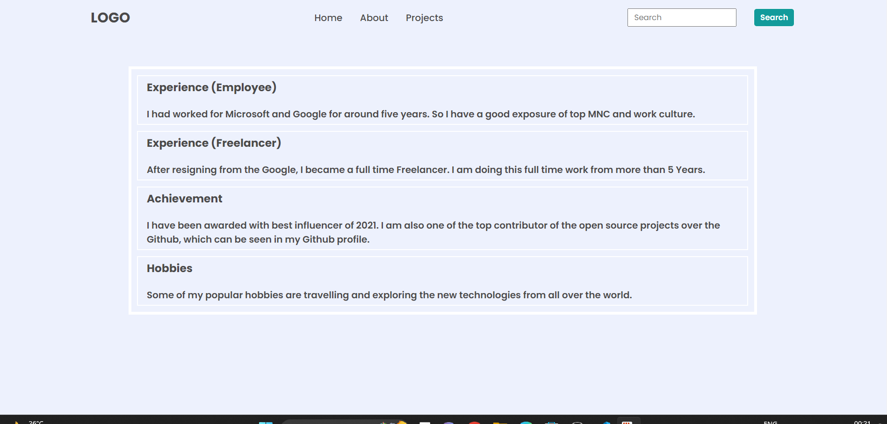

# DOM PROJECT 02

## Task 01
> TO CHANGE Baground Color of all h3 tag

 
**Before:**


**After Update:**


```js
const allh3=document.querySelectorAll(".accordian h3");

allh3.forEach(h3 => {
    h3.style.backgroundColor="#dadaf8" 
});
```

## Task 02
> To ADD SKILLS  Section

 
**Before:**


**After Update:**


```js
const div=document.querySelector(".accordian-wrapper");
const newDiv=document.createElement("div");
newDiv.className="accordian";
div.appendChild(newDiv);

const h3=document.createElement("h3");
newDiv.appendChild(h3)
h3.textContent="Skills"

const p=document.createElement("p");
newDiv.appendChild(p);
p.style.display="block"
p.textContent="I posses a very good command over the Full Stack Development technologies like MERN which can be seen in my work over Github.";
```


